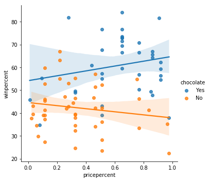

# Python

Apuntes que surgen de los cursos de kaggle.com

# Kaggle: Intro to Python

Hay una reglas primordiales dentro de este lenguaje, las cuales se conocen como *The Zen of Python* [(link)](https://en.wikipedia.org/wiki/Zen_of_Python). Dentro de lo cuales el más importante es

> Readability counts
>
> Explicit is better than implicit

## 1. Hello Python

* En Python no hace falta declarar el tipo de variable. Basta con usar `variable = valor` para asignar
* Se imprimen los valores con `print( [texto o valor a imprimir] )`
* Se comentan líneas con `# comentario `
* La indentación define *bloques de código* (code blocks). Todas las líneas consecutivas que se encuentren en la misma indentación, formarán parte del mismo bloque de código.
* `type(spam_amount)` nos permite conocer el tipo de variable
* Hay 8 operaciones aritméticas disponible en este lenguaje
* El orden las operaciones se defino por medio del acrónimo PEMDAS: Parentesís, Exponentes, Multiplicar, Dividir, Adicción Substracción.

## 2. Function and Getting Help

* Pedir ayuda sobre una función específica se hace por medio de `help([nombre función SIN ARGUMENTOS])`
* Las funciones se definen así

```python
def least_difference(a, b, c):
    diff1 = abs(a - b)
    diff2 = abs(b - c)
    diff3 = abs(a - c)
    return min(diff1, diff2, diff3)
```

Presta atención a cosas como: para definirla se utiliza `def`, después de definir los argumentos se pone un `:`, todo el bloque de código que compone la función está indentado, y la salida está definida por un `return`. Si no se agrega el return tenemos salidas vacías

* Si se quieren agregar comentarios a la función creada en Python se puede hacer uso de **Docstrings**

```python
def least_difference(a, b, c):
	"""Return the smallest difference between any two numbers among a, b and c.
    
    >>> least_difference(1, 5, -5)
    4
    """
    diff1 = abs(a - b)
    diff2 = abs(b - c)
    diff3 = abs(a - c)
    return min(diff1, diff2, diff3)
```

Todas la explicación que se desplega con `help()` está dentro de las 3 `"""` de  la función. El ejemplo siempre se escribe luego de `>>>`

* Python te da la opción de fijar argumentos por defecto cuando declaras la función, la forma de hacerlo es la siguiente:

```python
def greet(who="Colin"):
    print("Hello,", who)
greet()
greet(who="Kaggle")

# Hello, Colin
# Hello, Kaggle
```

* Existe algo llamado  *Higher Order Functions* y es basicamente cuando una función es aplicada a otra función, de un modo similar a `fn(fn(arg))`
* Si se hace esto `round(345189,-2)` se obtiene a la salida 345200. Entonces la función sirve para redondear las decenas, centenas, etc.

## 3. Booleans and Conditionals

* Las operaciones de comparación definidas dentro de python son las que ya te sabes. Es decir `!=`,`==`,`>=`, etc

* Las comparaciónes entre valores arítmeticos y valores arítméticos y valores de texto no son posibles.  `3 == '3' (False) `

* Los operador booleanos que están reconocidos por el lenguajes son `not` , `and` y `or`, con ese orden de [prevalecencia](https://docs.python.org/3/reference/expressions.html#operator-precedence) (NOT se opera primero, luego AND, luego OR)

  El condicionales disponibles son `if`, `elif` o `else`. Se usan así

```python
def inspect(x):
    if x == 0:
        print(x, "is zero")
    elif x > 0:
        print(x, "is positive")
    elif x < 0:
        print(x, "is negative")
    else:
        print(x, "is unlike anything I've ever seen...")
```

* Se pueden convertir cualquier valor a booleano por medio de `bool()`. Cualquier valor da True excepto 0 y NaN. Otras funciones disponibles son `int()` y `float()`
* Dentro de Python existe también el **operador ternario**, la sintaxis es diferente a JS. Se tiene que

```python
outcome = 'failed' if grade < 50 else 'passed'

#Es equivalente a 
	if grade < 50:
        outcome = 'failed'
    else:
        outcome = 'passed'
```

### EJEMPLOS

```python
#This condition would be pretty complicated to express using just and, or and not, but using boolean-to-integer conversion gives us this short solution:
return (int(ketchup) + int(mustard) + int(onion)) == 1
#Fun fact: we don't technically need to call int on the arguments. Just by doing addition with booleans, Python implicitly does the integer conversion. So we could also write...

return (ketchup + mustard + onion) == 1
```

## 4. Lists

* Las listas se crean así `primes = [2,3,5,7]` o así `planets = ['Mercury','Venus',Earth]`
* También puedes hacer listas de listas, o tener valores variados `things = [32,'raindrop',help]`

### Indexing, Slicing, Changing

* `planets[0]` primer elemento. `planets[-1]` last element
* `planets[0:3]` para lo primeros 3 elementos. Para elementos consecutivos. `planets[1:-1]` regresa todos los elementos menos el primero y el último.
* Para cambiar el valor de una lista `planets[3] = 'Malacandra' `. Cambiar nombre de los primeros 3 planetas `planets[:3] = ['Mur', 'Vee', 'Ur']`
* Si tienes una lista de lista, puedes aplicar la siguiente `teams[-1][1]`. Esto nos regresa el segundo elementos de la primera lista.

### List functions

* `len` te regresa el tamaño de una lista. Ej `len(planets)`
* `sorted` te los regresa ordenados de menos a mayor (alfabético o numérico)
* `sum` suma todos, `min` y `max` hacen lo propio

### Objetos

Python también maneja el concepto de los objetos. Hasta los números son objetos, que pueden tener una parte imaginaria. Ej

```python
x = 12
# x is a real number, so its imaginary part is 0.
print(x.imag)
# Here's how to make a complex number, in case you've ever been curious:
c = 12 + 3j
print(c.imag)
```

Como en cualquier otro lenguaje, un objeto tienen **métodos** (funciones) y **atributos** asociados. Para conocer la función de algun método específico se puede utilizar la función help. Ej. `help(x.bit_length)`

### Métodos frecuentes

* `list.append('Pluto')` modifica una lista (lista) agregando un elementos al final. Este método existe sólo en elementos del tipo lista
* `list.pop()` retira el último elemento de una lista
* `list.index(valor)` regresa el número del índice de la lista que contenga el valor. El valor puede ser un número o un string
* Si sólo queremos saber si un elemento se encuentra dentro de una lista, se puede utiliza `"Earth" in planets` lo cual retorna un booleano

### Tuplas

Son casi como una lista, con 2 diferencias principales

1. La sintaxis para crearlas se hace con paréntesis
2. No pueden ser modificadas. 

Las tuplas se utilizan mucho con funciones que tienen valor valores de retorno. Voy con 2 breves ejemplos. 

```python
t = (1, 2, 3) #declaracion
t = 1, 2, 3  #equivalente

# tupla a la salida
x = 0.125
x.as_integer_ratio() # ( 1 , 8 )
# se puede guardar directamente a variables
numerator, denominator = x.as_integer_ratio()

# aqui demostramos
a = 1
b = 0
a, b = b, a
print(a, b)
```

#### EJEMPLOS

```python
a = [1, 2, 3] #length: 3
b = [1, [2, 3]] #length: 2
c = [] #length: 0
d = [1, 2, 3][1:] #length: 2, porque del arreglo original, se están tomando los últimos 2 valores
```

Fashionably Late, son aquellos invitados que llegan luego de la mitad pero sin ser los últimos. Código

```python
def fashionably_late(arrivals, name):
    """Given an ordered list of arrivals to the party and a name, return whether the guest with that name was fashionably late.
    """
    impar = len(arrivals) % 2 # Si es impar es 1
    order = arrivals.index(name) #posición del nombre
    
    if (order == len(arrivals)-1): ## llegó de último
        return False
        #return name + " is late"
    elif (impar == 0 and order < len(arrivals)//2):
        return False
        #return name + " is early"
    elif (impar == 1 and order < (len(arrivals)//2)+1):
        return False
        #return name + " is early
    else:
        return True
        #return name + " is fashionable late"
```


## 5. Loops

### Ciclo For

```python
planets = ['Mercury', 'Venus', 'Earth', 'Mars', 'Jupiter', 'Saturn', 'Uranus', 'Neptune']
for planet in planets:
    print(planet, end=' ')
```

El ciclo for en Python necesita 2 cosas. 

* Una nombre de variables para iterar. En este caso `planet` pero puede ser `var`, `x`, etc
* Un lista o set de valores sobre los cuales se iterara `planets`

Cuando se usa `in` se puede hacer un ciclo **for** en cualquier objeto que soporte iteraciones.  Aquí otro ejemplo de como se pueden llamar el ciclo con tuplas y con variables globales como product

```python
multiplicands = (2, 2, 2, 3, 3, 5)
product = 1
for mult in multiplicands:
    product = product * mult
print(product)
```

Podemos iterar un string

```python
s = 'steganograpHy is the practicE of conceaLing a file, message, image, or video within another fiLe, message, image, Or video.'
msg = ''
# print all the uppercase letters in s, one at a time
for char in s:
    if char.isupper():
        print(char, end='') #imprime HELLO
```

python cuenta con la función **range()** la cual regresa una serie de número `range (start, stop, step)`

```python
for i in range(5):
    print("Doing important work. i =", i)
```

### Ciclo while

Este ciclo itera hasta que se cumpla cierta condición

```python
i = 0
while i < 10:
    print(i, end=' ')
    i += 1 # 0 1 2 3 4 5 6 7 8 9 
```

### List comprehension 

**Lista por comprensión** es una de las características más cool y deseadas y únicas de python. Permite hacer equivalencia con lenguajes como DML  de SQL. Pero ya entraremos en eso

```python
squares = [n**2 for n in range(10)]
# [0, 1, 4, 9, 16, 25, 36, 49, 64, 81]
```

Nos demuestra como podemos usar lazos dentro de listas. Ahora, se pueden utilizar todo tipo de cosas 

```python
#buscar 'planets' dentro de la lista planets que tengan un nombre de menos de 6 letras, guardarlos en una lista

short_planets = [
	planet #operación
	for planet in planets
	if len(planet) < 6
]
print(short_planets) #['Venys','Earth','Mars']
```

Esto es equivalente a una expresión de SQL que utilice where. Voy con otro ejemplo

```python
[
    planet.upper() + '!' 
    for planet in planets 
    if len(planet) < 6
] # ['VENUS!', 'EARTH!', 'MARS!']
```

Lo que es equivalente a SELECT, FROM and WHERE de SQL. También se puede hacer

```python
def count_negatives(nums):
    return len([
        num 
        for num in nums
        if num < 0
    ])

## otra opción más compacta aprovechando la característica de python de sumar los booleanos como si fueran números
	return sum([num < 0 for num in nums])
```

> El ciclo for en Python puede aplicarse de dos formas. 1) La normal: Cuando se declara el ciclo y dentro de él se indica cual será la operación que se va a hacer. 2) La especial: En las listas por comprensión la operación se declara antes y luego se escribe el `for`


#### EJEMPLOS

```python
#conseguir número divisible por 7
def has_lucky_number(nums):
    return any([num % 7 == 0 for num in nums])
```

Otro más

```python
def elementwise_greater_than(L, thresh):
    """Return a list with the same length as L, where the value at index i is 
    True if L[i] is greater than thresh, and False otherwise.
    
    >>> elementwise_greater_than([1, 2, 3, 4], 2)
    [False, False, True, True]
    """
    return [
        var > thresh
        for var in L
    ]
```

## 6. String y Diccionarios

Python resalta en la métodos que tiene para manipular strings.

* Para escribir caracteres raros dentro de una cadena el mejor método que se puede hace es "escaparlos". Ej. `'Pluto\'s a planet! ` 
* Algunos caracteres que pueden escaparse son `\n (new line) \\ \"`
* `print("hello",end='')` imprime hellopluto
* Python cuenta con el triple_quotedtext, si  se pone al final agrega un salto de línea equivalente a \n

```python
triplequoted_hello = """hello
world"""
print(triplequoted_hello)
# hello
# world
# 
```

#### Secuencias

Las secuencias son muy parecidas a las listas

```python
#los strings son secuencias
planet = 'Pluto'
planet[0] # P
planet[-3:] # uto
len(planet) # 6 

# Tienen una única diferencia, **No se pueden modificar**
planet[0] = B
```

### Métodos

```python
claim = "Pluto is a planet"
claim.upper() # PLUTO IS A PLANET
claim.lower() # pluto is a planet
claim.index('plan') # 11 - busca el índice del caracter donde aparece
rstrip('.,') # quita los caracteres que están dentro del paréntesis a la derecha del string. Ej 'calma, pueblo' => 'calma'

claim.split() # ['Pluto','is','a','planet!']
'-'.join(claim) # Pluto-is-a-planet!
```

#### Construyendo strings con format()

Llamamos a [format()](https://pyformat.info/) en una "cadena de formato", donde los valores de Python que queremos insertar están representados con marcadores de posición `{}`. Básicamente funciona como RegEx

```python
"{}, you'll always be the {}th planet to me.".format(planet, position)

# "Pluto, you'll always be the 9th planet to me."
```

### Diccionarios

Es otro tipo de DataStructure que te permite ordenar datos en función de **Keys**.

```python
numbers = {'one':1, 'two':2, 'three':3}

numbers['one'] # 1 

numbers['eleven'] = 11 # Agrega un nuevo elementos al diccionario. NO ES UNA LISTA. las listas se definen entre []

numbers['one'] = 'Pluto' # Renombra un valor del diccionario
```

Los diccionarios soportan todas muchas de las combinaciones de funciones presentadas hasta ahora. Por ejemplo, **diccionarios por compresión**: Veamos

```python
planets_to_initial = {planet: planet[0] #funcion
					  for planet in planets #bucle
					 }#fin diccionario

# IMPRIME
#{'Mercury': 'M',
# 'Venus': 'V',
# 'Earth': 'E',	
```

**Un bucle aplicado a un diccionario se aplicará sobre sus llaves (keys)**

```python
numbers = {'one': 'Pluto', 'two': 2, 'three': 3, 'eleven': 11} #diccionario

# Este ejemplo muestra como utilizar format como si fueran RegEx. 
# El format se aplica para crear strings

for k in numbers:
    print("{} = {}".format(k, numbers[k]) )
    
# IMPRIME
# one = Pluto
# two = 2
# ...
```

Podemos acceder a una colección de todas llaves y los valores por medio de las funciones `dict.keys()` y `dict.values()`

#### EJEMPLOS

```python
c = len('it\'s ok') # 7, el \ no se considera un caracter por si sólo
d = len("""hey""")  # 3, las comillas triples no son parte de un string
```

En esta sección hubo una operación de búsqueda de palabras dentro de una lista de strings que fue todo un reto, la ídea era indica cual de estos lista contenía la palabra clave y regresear el índice del artículo. Ej [0] primer articulo, [1,3] segundo y cuarto artículo.

Aquí presento la solución adaptada. Fue clave en este caso 2 cosas. Recordar que existe la función enumerate() y que se pueden guardar las salida de un bucle en dos variables distintas

```python
def word_search(doc_list, keyword):    
    indices = [] 
    for i, doc in enumerate(doc_list): #la función enumerate generar un índice para las listas. Ej, 0,1,2
        word_list = doc.split()
        #normalized = [token.strip(".,").lower() for token in words] #listas por comprensión
        normalized = [
            palabra.strip(".,").lower() #operación
            for palabra in word_list #bucle
        ]
        #print(normalized)
        if keyword.lower() in normalized:
            indices.append(i)
    print(keyword, indices)
    return indices
```

La verdad es un bucle complicado y no entiendo bien como funciona la variable `i` aquí.

El siguiente ejemplo es para la reutilización de la función de forma de que se pueda aprovechar para varios valores de keywords y guardarlos en un vector. El resultado es este

```python
def multi_word_search(doc_list, keywords):
    """
    Takes list of documents (each document is a string) and a list of keywords.  
    Returns a dictionary where each key is a keyword, and the value is a list of indices
    (from doc_list) of the documents containing that keyword

    >>> doc_list = ["The Learn Python Challenge Casino.", "They bought a car and a casino", "Casinoville"]
    >>> keywords = ['casino', 'they']
    >>> multi_word_search(doc_list, keywords)
    {'casino': [0, 1], 'they': [1]}
    """
    keyword_to_indices = {}
    for keyword in keywords:
        keyword_to_indices[keyword] = word_search(doc_list, keyword)
    return keyword_to_indices
```


# Kaggle: Pandas

## 1. Creating, Reading and Writing

Pandas en la librería más utilizada para en Python para Data Analysis. Para usar pandas usualmente se empieza con esta línea de código `import pandas as pd`

Existes dos objetos básicos

* **DataFrame**: Son tablas, que pueden tener cualquier tipo de valor, sea un entero o un strings `pd.DataFrame({'Yes': [50, 21], 'No': [131, 2]})`

Esto se ve así

|      | Yes  | No   |
| ---- | ---- | ---- |
| 0    | 50   | 131  |
| 1    | 21   | 2    |

En caso de strings este es un ejemplo `pd.DataFrame({'Yes': [50, 21], 'No': [131, 2]})`

Pandas asigna a las filas una numeración automática siguiendo un correlativo, sin embargo, muchas veces se decide utilizar un índice `index`, el cual usualmente se agrega a la creación cuando se crea el dataframe. Ej `pd.DataFrame({'Yes': [50, 21], 'No': [131, 2]}, index=['Product A','Producto B'])`

* **Series**

Las series son una secuencia de data. *Un dataframe es un tabla, un serie es un lista*. Y se declara es ésta forma `pd.Series([1, 2, 3, 4, 5])`

En esencia, una serie es una columna de un DataFrame. Puedes asignarle valores a las filas (rows) pero la columna tiene una única variable *name*. La salida es `pd.Series([30, 35, 40], index=['2015 Sales', '2016 Sales', '2017 Sales'], name='Product A')`

### Leer CSV

La forma más común de obtener datos es por medio de CSV, por ejemplo

Para ello, ya esto lo hicimos en el curso anterior, pero por ejemplo, aquí repetimos

```python
# leer cvs y guardarlo en un data frame
wine_reviews = pd.read_csv("../input/wine-reviews/winemag-data-130k-v2.csv")
#la función tiene hasta 30 parámetros que se pueden específicar, siendo el más utilizado el index_col=
#forma de los datos
wine_reviews.shape
```

### Grabar CSV

Para grabar un CSV en el disco Pandas te da la opción de usar el comando *to_csv* para guardar un DataFrame llamado animals en un archivo csv llamado cows_and_goats `animals.to_csv("cows_and_goats.csv")`

## 2. Indexar, Seleccionar, Asignar

Para acceder a una columna de un DataFrame llamado *review* por medio de`review.country`. Si está configurado a modo diccionario, se puede acceder a ellos con `reviews['country']`, siendo el útimo el más versatil porque soporta cualquier tipo de caracteres

Para tomar un valor dentro de una columna específica `reviews['country'][0]`

### Indexar

Pandas utiliza dos funciones para indexar y traer datos a partid de un data frames. En Pandas, la sintaxis prioriza extraer filas completas que columnas (van primero). Es decir, estas funciones trabajan contrarias a lo que se hace en Python nativo 

* **iloc (index-based selection)**

```python
#extraer fila 0
reviews.iloc[0]
#extraer columna 0. ':' todo en python
reviews.iloc[:, 0]
#extraer primeras 3 filas de columna 0
reviews.iloc[:3,0
#extraer fila específicas de columna 0
reviews.iloc[[0,3,7],0]
#extraer ultimas 5 filas
reviews.ilos[-5:]
```


* **loc (labed based selection)**

Un ejemplo de cómo utilizar este comando es `reviews.loc[:, ['taster_name', 'taster_twitter_handle', 'points']]`, se observa que en este caso es clave el nombre de las columnas. 

Conceptualmente `iloc` es más simple porque tratamos todo como una gran matriz. `loc` utiliza la información de los índices para hacer su trabajo, pero usualmente tu dataset tiene índices definidos, razón por la cual se utiliza mucho más `loc`

La principal diferencia entre ambas librería es la forma en que hacen el índexado. Se puede profundizar, pero de momento solo copiaré el siguiente párrafo

> This is particularly confusing when the DataFrame index is a simple numerical list, e.g. `0,...,1000`. In this case `df.iloc[0:1000]` will return 1000 entries, while `df.loc[0:1000]` return 1001 of them! To get 1000 elements using `loc`, you will need to go one lower and ask for `df.loc[0:999]`.

#### EJEMPLOS

```python
#Select the records with index labels 1, 2, 3, 5, and 8, assigning the result to the variable sample_reviews.
sample_reviews = 
reviews.iloc[[1,2,3,5,8],:]

#Create a variable `df` containing the `country`, `province`, `region_1`, and `region_2` columns of the records with the index labels `0`, `1`, `10`, and `100`
df = reviews.loc[[0,1,10,100],['country', 'province', 'region_1', 'region_2']]

#Create a DataFrame top_oceania_wines containing all reviews with at least 95 points (out of 100) for wines from Australia or New Zealand.
top_oceania_wines = reviews.loc[ (reviews.country.isin(['Australia', 'New Zealand']) ) & (reviews.points >= 95) ]
```


### Cambiar índice

Si dentro de un dataset identificar un índice que es más conveniente, se puede cambiar usando `reviews.set_index("indice de la columna")`

#### Selección condicional

Podemos utilizar lo anterior junto con condionales para extraer data con propiedades específicas. Ej `reviews.loc[reviews.country == 'Italy']` nos regresa todos los datos del dataframe *review* que tienen como país Italia

Tambieén se pueden concatenar condiciones

```python
#regresa vino de italia Y con más de 90 puntos
reviews.loc[(reviews.country == 'Italy') & (reviews.points >= 90)]

#regresa vinos de italia O con más de 90 puntos
reviews.loc[(reviews.country == 'Italy') | (reviews.points >= 90)]
```

Pandas también cuenta con una selector condicional incluído, se defino como isin. Se usa: `reviews.loc[reviews.country.isin(['Italy', 'France'])]`. Selecciona tuplas con vinos de Francia e Italia. Esto nos permite buscar los no nulos `reviews.loc[reviews.price.notnull()]` hay uno equivalete para los nulos

### Asignar datos

Hay varios ejemplo

```python
#escribe 'everyone' en la columna 'critic'
views['critic'] = 'everyone'
```

## 3. Mapear, aplicar funciones

### Funciones para análisis de datos

```python
#hacer análisis de los datos. Diferentes  salidassi son strings o números
reviews.points.describe()
#funciones específicas hay muchas
reviews.points.mean()
reviews.points.mediana()
reviews.points.unique()
reviews.points.value_counts()
```

### Mapear

Es una función que toma un grupo de datos  y los convierte en otro.  Hay dos funciones principales

```python
#función map. Por  p 
reviews.points.map( lambda p: p - review.points.mean() )

#apply() permite aplicar funciones más complejas. Primero se define formalmente la función y luego se le hace referencia dentro de apply
def remean_points(row):
    row.points = row.points - review_points_mean
    return row
reviews.apply(remean_points, axis='columns')
#si se tiene un a función con un parámetro axis, la función transforma la columna específicada, en vez de la fila
```

#### EJEMPLOS

```python
#Soy un comprador estratégico de vino. ¿Qué vino es la "mejor oferta"? Cree una variable `bargain_wine` con el título del vino con la relación puntos por precio del conjunto de datos

bargain_idx = (reviews.points / reviews.price).idxmax()
#funcion idxmax() retorna el id de la primera ocurrencia del máximo en el conjunto indicado
bargain_wine = reviews.loc[bargain_idx, 'title']


#Contar las veces en que las palabras "tropical" o "fruity" se utilizan para describir un vino. Sumarlas, y guardar esto en una serie llamada descriptor_counts
n_trop = reviews.description.map(lambda desc: "tropical" in desc).sum()
n_fruity = reviews.description.map(lambda desc: "fruity" in desc).sum()
descriptor_counts = pd.Series([n_trop, n_fruity], index=['tropical', 'fruity'])
```


%%%%%%%%%%%%%%%%%%%%%%%

ESTE ES UN BLOQUE QUE SIEMPRE SE USA EN LOS CURSOS DE KAGGLE, DEBE TENER INFORMACIÓN IMPORTANTE QUE TODAVÍA NO ENTIENDO POR COMPLETO

```python
import pandas as pd
pd.set_option('max_rows', 5)
from learntools.core import binder; binder.bind(globals())
from learntools.pandas.creating_reading_and_writing import *
print("Setup complete.")
```

## 7. External Libraries

Como Data Scientist harás uso de una importante cantidad de librería que están disponibles para ser utilizadas en Python. Se usa el comando `import` para importar librerías. 

#### Librería math

```python
import math
print("It's math! It has a type {}").format(type(math)))
# It's math! It has type <class 'module'>
```

Dentro de Python existe **modulos**. Los cuales son colecciones de variables. Para visualizar todas las variables se puede ejecutar el comando `print(dir(math))`.  Si queremos ver una solo, podemos acceder a ella como con cualquier otro método de función. Ej `math.pi`. Al igual que con cualquier otra función estos módulos responden ante el comando help(). Ejeemplo `help(math.log)`

### Renombrar

En Python frecuentemente veras que se importan módulos siguiendo este patrón

```python
import math as mt #renombra el módulo
mt.pi
#3.141592653589793
```

Pueden importar todas las variables de un módulo por medio del comando `import *`, lo que hace que estén disponibles para ti siempre sin necesidad del `. `. Sin embargo, se te puede embasurar tu espacio de trabajo 

```python
from math import * #importar todo
print(pi, log(32, 2))
```

### Submódulos

Hay módulos que apuntas a nuevos módulos, tipo programación orientada a objetos. Un ejemplo lo tenemos con la librería `numpy` la cual tienen métodos únicos dentro de `random` razón por la cual se utilizan 2 puntos.

```python
import numpy
rolls = numpy.random.randint(low=1, high=6, size=10)
rolls
```

### HERRAMIENTAS PARA ENTENDER OBJETOS EXTRAÑOS

1. `type()` **qué es esto**. 
2. `dir()` **qué puedo hacer con esto**. Ej `print(dir(rolls))`. Piensa en lo que quieres hacer para tu problema específico, una vez lo identifiques, busca el método que pueda ayudarte. 
3. `help()` **cuéntame más**. He

#### [Operator Overloading](https://docs.python.org/3.4/reference/datamodel.html#special-method-names)

Cada librería, cada módulo que utilices en Python, puede hacer uso de los operadores de +, <, ==, como mejor le parezca. Cuando alguien crea una librería define como se utilizarán los métodos y las variables dentro de ellas. 

Es concepto se conocer como *sobrecarga de los operadores* y es muy frecuente en librerías como tensorflow. En ella, el uso de los operadores cambiar considerablemente con respecto a la redacción principal de Python. 

Sabes que cuando llamas a help() o dir() en las respuestas te aparecen valores como estos:

```python
 '__str__', '__subclasshook__', 'append', 'clear', 'copy', 'count', 'extend', 'index', 'insert', 'pop'
```

En Python los programados definen como se comportan los operadores por medio de métodos con nombres especiales que comienzan y terminan con doble-underscore como   `__contains__` , `__add__` , etc. 

Ejemplo. `x in [1,2,3]` es lo mismo que `[1,2,3].__contains__(x)`

# Kaggle: Data Visualization

[Link del curso](https://www.kaggle.com/learn/data-visualization) 

Todos los cursos de kaggle utilzian *Jupyter Notebooks* para aplicar lo que hace. Tengo la opción de guardar varios apuntes allí también (podría intentar copiarlos en Typora, pero si están en cloud es mejor, creo)

También veo que para configurar muchos de los *Notebook* siempre correr una función de configuración con `import pandas as pd`

## 1. Hello Seaborn

[Seaborn](https://seaborn.pydata.org/index.html) es una de las librería mas utilizadas para mostrar visualizar data en python. Revisar documentación luego para más información

#### Cargar datos CSV

```python
# Path del archivo .csv
fifa_filepath = "../input/fifa.csv"
# Guardar .csv en un archivo de data
fifa_data = pd.read_csv(fifa_filepath, index_col="Date", parse_dates=True)

#index_col: etiqueta de columna
#parse_dates: convertir todo a fechas
```

Para visualizar los datos cargados, se puede hacer uso de la función `fifa_data.head()`, para lo primeros o `fifa_data.tail()` para los últimos.

## 2. Gráfico tipo línea

```python
#Set width and height
plt.figure(figsize=(16,6))
#Set title
plt.title("Fifa Top Positions by Year")
#Line chart plot
sns.lineplot(data=fifa_data)
```

Si se quiere plotear una subset de datos, se puede recurrir al repetir el siguiente bloque según para cada set

```python
sns.lineplot(data=spotify_data['Shape of You'], label="Shape of You")
```

## 3. Gráfico Barra y de Calor

Para hacer un gráfico de barras se sigue la misma metodología pero con una instrucción diferentes

```python
# Read the file into a variable flight_data
flight_data = pd.read_csv(flight_filepath, index_col="Month")
```

Es importante indicar el `index_col` para hacer el plot del gráfico, en caso contrario el gráfico de barras no funciona. Es necesario en sns indicar un índice

```python
#ancho alto
plt.figure(figsize=(10,6))
# titulo
plt.title("Average Arrival Delay for SA by Month")
# plot bar chart
sns.barplot(x=flight_data.index , y=flight_data['NK'])
# Etiqueta eje vertical
plt.ylabel("Arrival delay (in minutes
```

En el caso de los mapas de calor nos sirven para visualizar matrices en función de 3 variables. Para ellos se sigue la misma metodología pero el código es

```python
sns.heatmap(data=flight_data, annot=True)
```

## 4. Gráfico de Dispersión de Puntos

**Scatter Plot**

![]()

Se cargan los datos al igual que en los casos anteriores. Para realizar el gráfico:

```python
sns.scatterplot(x=insurance_data['bmi'], y=insurance_data['charges'])
```

Tambien se pueden agregar líenas de regresión a esta clase de gráficos (profundizar aquí). Por medio del siguiente código

```python
sns.regplot(x=insurance_data['bmi'], y=insurance_data['charges'])
```

Ok, si pueden diferencia las gráficos con colores si se utilizar una tercera variable relacionada con el hue (gama de color). Se corresponde al primer gráfico de esta sección.

```python
sns.scatterplot(x=insurance_data['bmi'], y=insurance_data['charges'], hue=insurance_data['smoker'])
```

**Lmplot**


Hay un tipo de gráfico que nos permite generar líneas de tendencia para varios set de datos

```python
#omitir configuración de título, no se usa el comando plt.plot
sns.lmplot(x="bmi", y="charges", hue="smoker", data=insurance_data)
```

**Swarmplot**


O también gráfico de enjambre o *categorical scatter plot* sirve para separar variables en función de categoría específicas

```python
#Cargar data
insurance_data = pd.read_csv(insurance_filepath, index_col="id")
#Plotear
sns.swarmplot(x=insurance_data['smoker'],y=insurance_data['charges'])
```

Allí podemos ver que quienes más pagan son los fuman.

**Ejemplo**



> En este caso, el análisis que se puede hacer viene de la relación entre las otras dos variables. Por ejemplo. Los caramelos con chocolate tienden a ser más atractivos a pesar de tener un precio más alto. En cambio, los que no tienen chocolate son más económicos, si son más baratos.

## 5. Gráfico de Distribución de puntos

### Histogramas

Para crear un histograma, cargar la data como siempre y luego

```python
# Read the file 
iris_data = pd.read_csv(iris_filepath, index_col="Id", nrows=200)
# Histogram 
sns.distplot(a=iris_data['Petal Length (cm)'], kde=False)
# 'a' indica la columan que se va a tomar para crear el histograma
```

### Gráficos de densidad

Conocidos como '*kernel density estimate (KDE)*. Se podría decir que es un histograma suavizados

```python
sns.kdeplot(data=iris_data['Petal Length (cm)'], shade=True)
# 'shade' dibuja el área bajo la curva
```

También podemos juntar dos gráficos de densidad por medio del comando `sns.jointplot`


```python
# 2D KDE plot
sns.jointplot(x=iris_data['Petal Length (cm)'], y=iris_data['Sepal Width (cm)'], kind="kde")
```

La parte más oscura nos muestra la combinación de las combinaciones que ocurren más frecuentemente entre petalos y sepalos (parte verde que envuelve a la flor mientras crece)


Para generar gráficos como el de la imagen anterior es necesario crear 3 set de datos distintos, pero que tengas las mismas columnas, y luego plotearlos en simultaneo. El código:

```python
# Histograms for each species
sns.distplot(a=iris_set_data['Petal Length (cm)'], label="Iris-setosa", kde=False)
sns.distplot(a=iris_ver_data['Petal Length (cm)'], label="Iris-versicolor", kde=False)
sns.distplot(a=iris_vir_data['Petal Length (cm)'], label="Iris-virginica", kde=False)

# Add title
plt.title("Histogram of Petal Lengths, by Species")

# Force legend to appear
plt.legend()
```

Funciona de forma similar con los gráficos suavizados

## 6. Eligiendo el tipo de gráfico

- Trends / Tendencias

  \- A trend is defined as a pattern of change.

  - `sns.lineplot` - **Line charts** are best to show trends over a period of time, and multiple lines can be used to show trends in more than one group.

- Relationship / Relaciones

  \- There are many different chart types that you can use to understand relationships between variables in your data.

  - `sns.barplot` - **Bar charts** are useful for comparing quantities corresponding to different groups.
  - `sns.heatmap` - **Heatmaps** can be used to find color-coded patterns in tables of numbers.
  - `sns.scatterplot` - **Scatter plots** show the relationship between two continuous variables; if color-coded, we can also show the relationship with a third [categorical variable](https://en.wikipedia.org/wiki/Categorical_variable).
  - `sns.regplot` - Including a **regression line** in the scatter plot makes it easier to see any linear relationship between two variables.
  - `sns.lmplot` - This command is useful for drawing multiple regression lines, if the scatter plot contains multiple, color-coded groups.
  - `sns.swarmplot` - **Categorical scatter plots** show the relationship between a continuous variable and a categorical variable.

- Distribution

  \- We visualize distributions to show the possible values that we can expect to see in a variable, along with how likely they are.

  - `sns.distplot` - **Histograms** show the distribution of a single numerical variable.
  - `sns.kdeplot` - **KDE plots** (or **2D KDE plots**) show an estimated, smooth distribution of a single numerical variable (or two numerical variables).
  - `sns.jointplot` - This command is useful for simultaneously displaying a 2D KDE plot with the corresponding KDE plots for each individual variable.

### Opciones de configuración

La librería `snsplot` nos permite configurar como se verá nuestro gráfico con pocas líneas de código

```python
# Change the style of the figure to the "dark" theme
sns.set_style("dark")

#Seaborn has five different themes: (1)"darkgrid", (2)"whitegrid", (3)"dark", (4)"white", and (5)"ticks"
```

## 7. Kaggle Datasets. Proyecto Final

Kaggle cuenta con una extensa lista de datasets disponibles para trabajr, incluso te da la opción de colgar el tuyo, siempre y cuando puedas pasarlo en formato CSV. En esta sección vamos a trabajar un proyecto totalmente nuevo y desde cero.

Primero ir a `Fila > AddData` y buscar el set de datos con el que deseas trabajar. Luego, 

